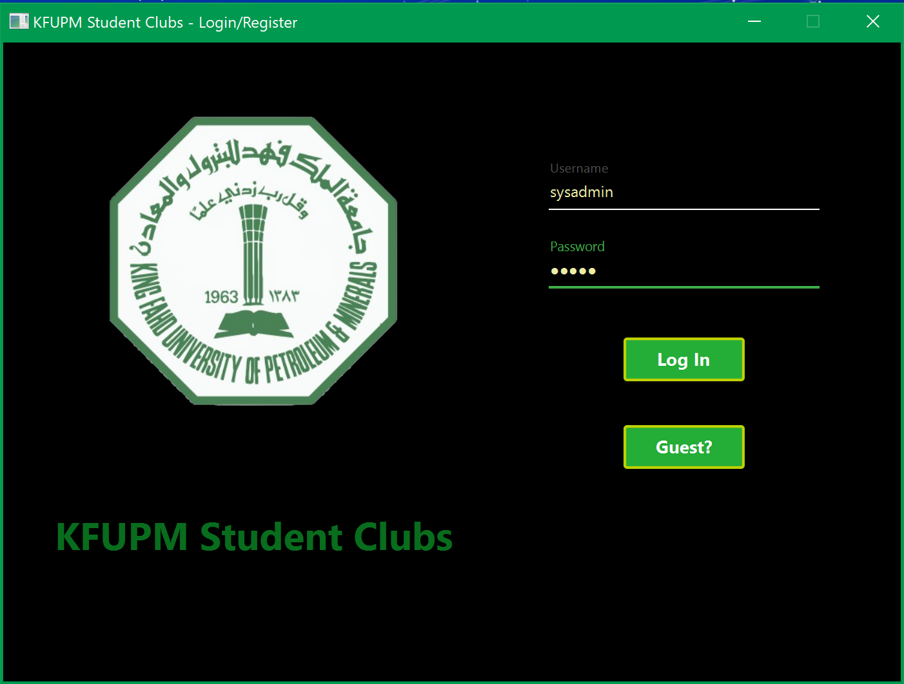
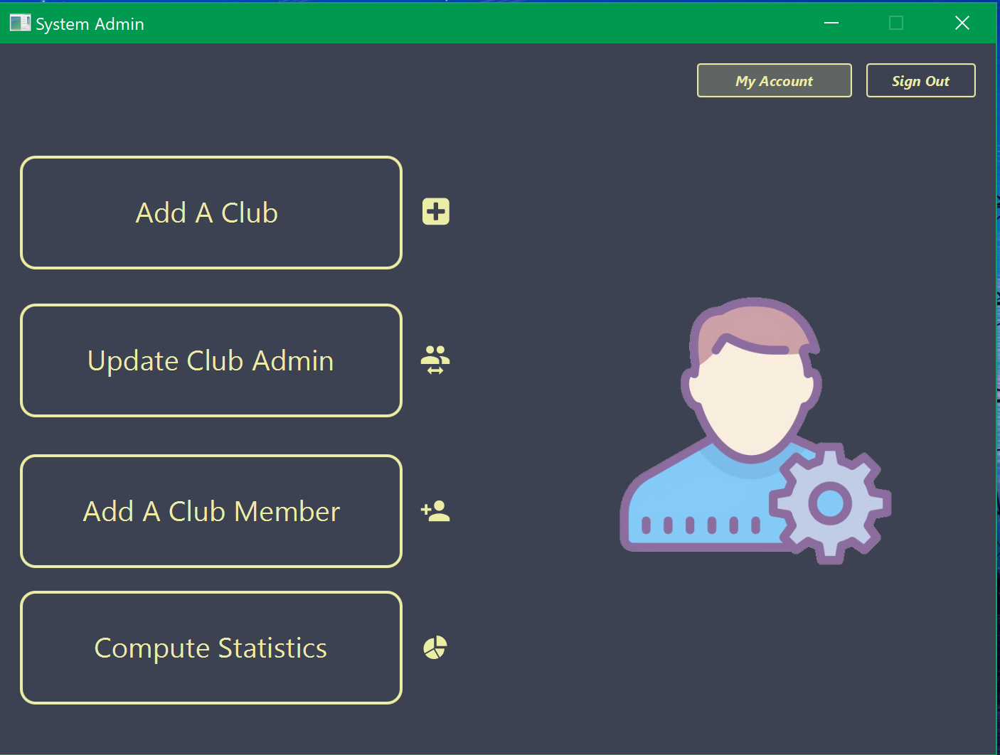
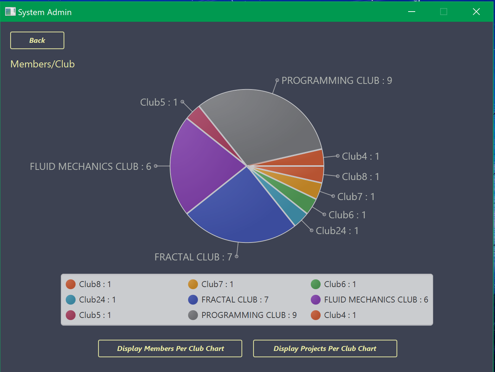
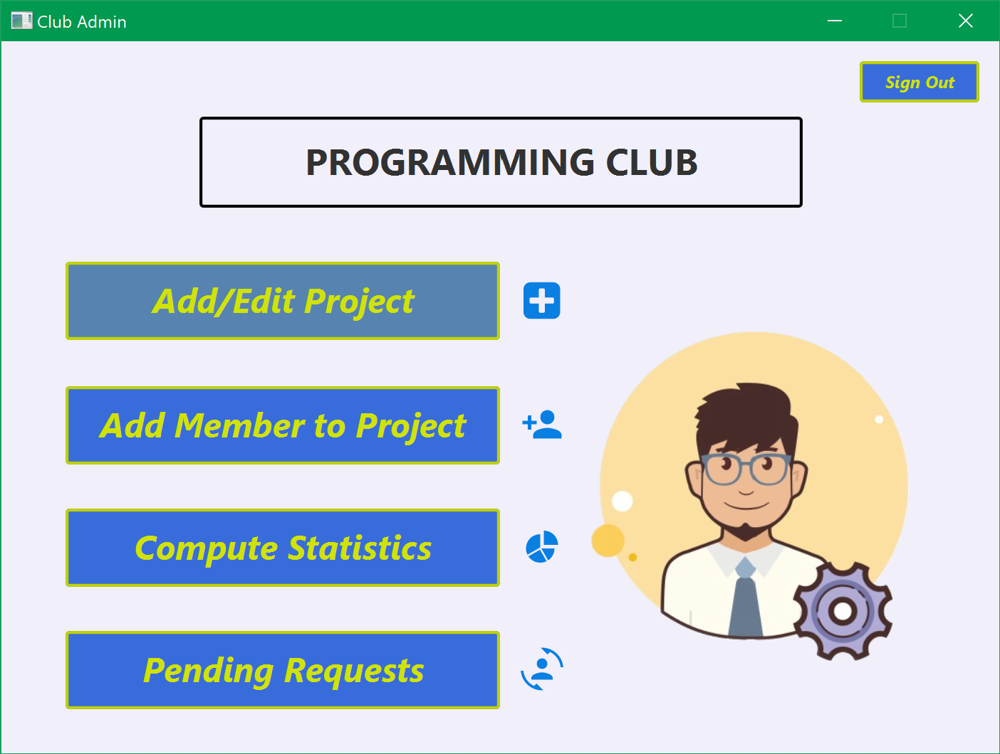
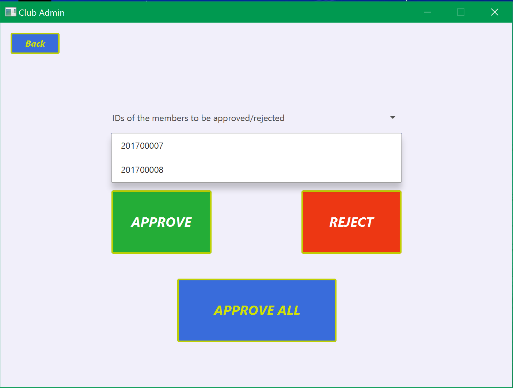
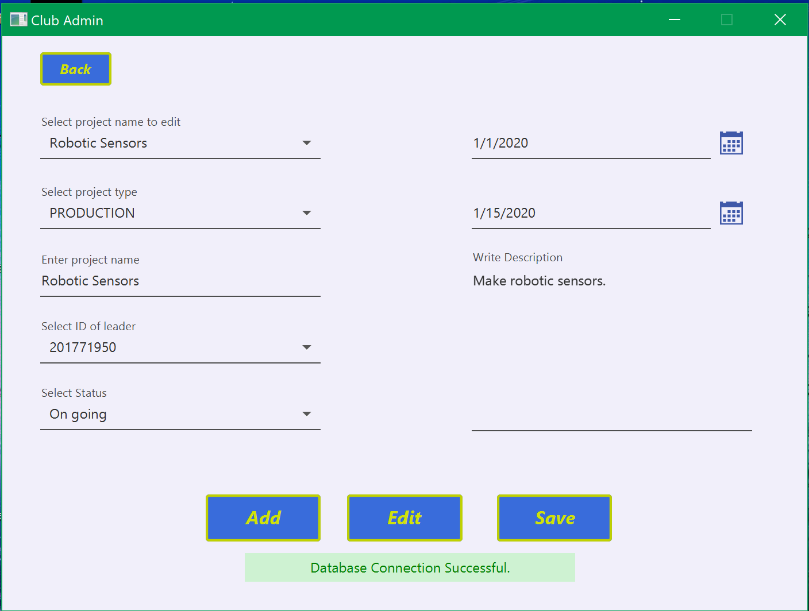
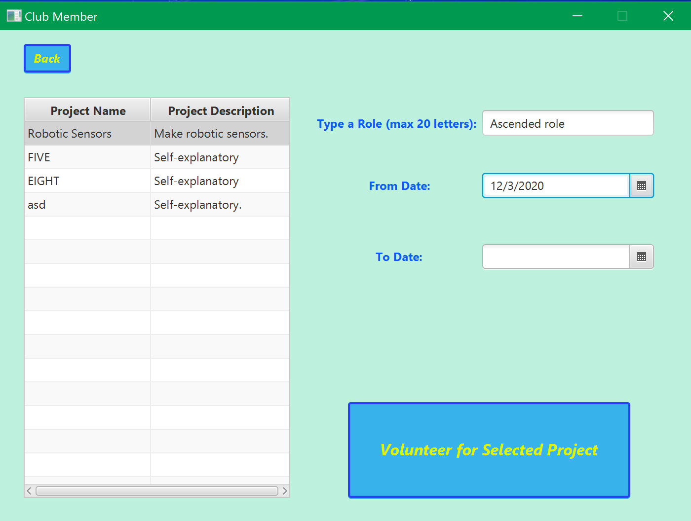
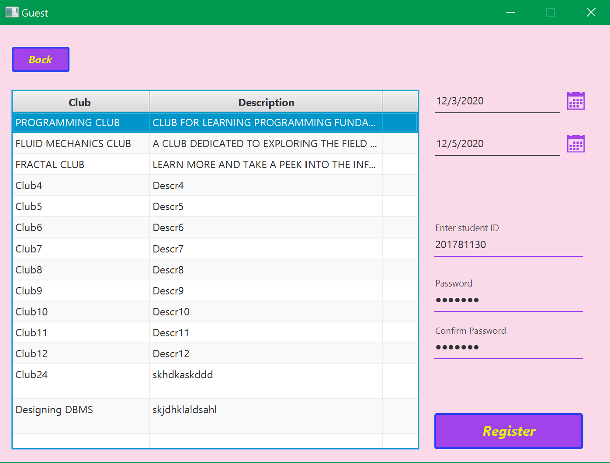
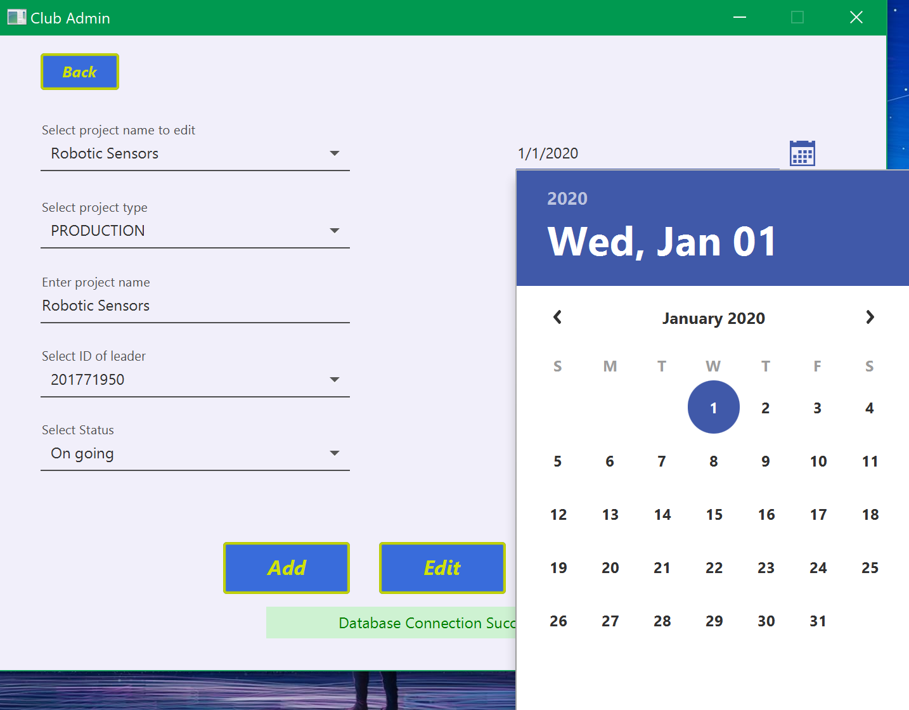

# KFUPM Clubz
  
  
  
  
  Course Project: ICS 324/201 - Build a full stack KFUPM club management system.

## Description
   Build a full stack KFUPM club management system. For more details, see *project_docs* folder.

## Screenshots Of The Application

  

  

  

## Project Partners/Contributors
   - [Farhan AbdulQadir](https://github.com/Vegeterian)
   - [AbdulJawad Mohammed](https://github.com/abbaddon1001)

